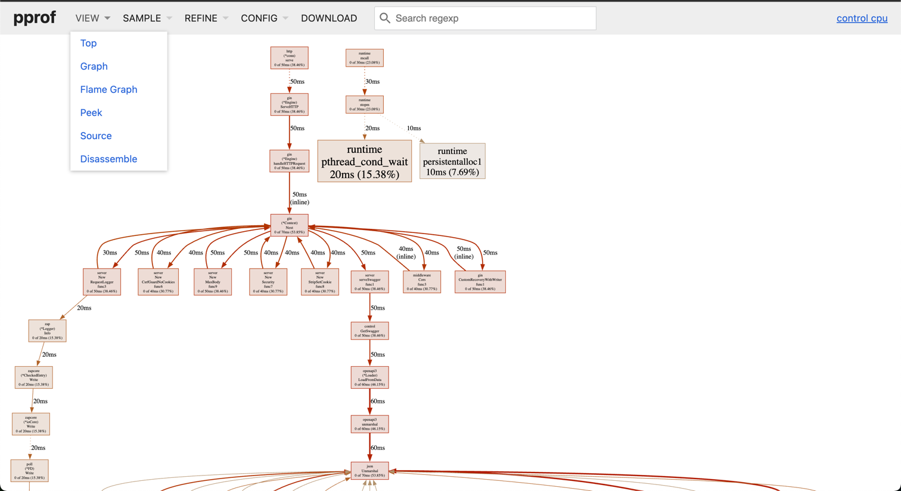

# Den Den Mushi Proxy

Proxy server thing

## Build all
```bash
make
```
Outputs binaries in `bin/` directory.

## Run without Building

From root run:
```bash
make run CMD=proxy
```
```bash
make run CMD=control
```

## OpenAPI

Docs: http://localhost:55007/swagger/control <br>
JSON: http://localhost:55007/swagger-spec/control.json

### Generate Golang Server Stub
[gen.go](openapi/control/gen.go)

```bash
make generate
```

### Generate Angular code
```bash
make generate-client
```
## Load Test (switch to load-test branch)

Apache JMeter 5.6.3

1. Download Jmeter
   https://jmeter.apache.org/download_jmeter.cgi

2. Install Plugin Manager
   https://jmeter-plugins.org/install/Install/https://jmeter-plugins.org/install/Install/

3. Install WebSocket Samplers by Peter Doornbosch

   a. Open JMeter

   b. Options > Plugins Manager > Available Plugins

   c. Apply changes and restart

4. Run JMeter

5. Open [simple_load_test.jmx](simple_load_test.jmx)


## Service file thing

- todo: read https://www.digitalocean.com/community/tutorials/understanding-systemd-units-and-unit-files

## Vuln scan

```bash
go install golang.org/x/vuln/cmd/govulncheck@latest
govulncheck ./...
```

## Go Profiler: Pprof
http://127.0.0.1:6060/debug/pprof/

### Enabling Pprof
config.json
```json
  "Pprof": {
    "IsEnabled": true,
    "Port": 6060
  },
```

### Launch Web Profiler
Options
- heap
- goroutine
- profile (CPU)

```bash
go tool pprof -http=:8081 'http://127.0.0.1:6060/debug/pprof/<option>'
```


### Exporting
```bash
curl http://127.0.0.1:6060/debug/pprof/ --output pprof.tar.gz
```


## Why blacklist filter won't work


### base64 to gzip to bash
```bash 
a=as
s`555`et -- bi
ec`123`h`bbbb`o H4sIAIzmgmgAAysuBQB5vaRlAgAAAA== |  b"$a"e64 -d -d | /usr/bi`hello`n/gzi* -d | /"$@"n/b"$a"*

```

equals
```bash
echo H4sIAIzmgmgAAysuBQB5vaRlAgAAAA== |  b"$a"e64 -d -d | /usr/bin/gzi* -d | /"$@"n/b"$a"*
```

```bash
echo H4sIAIzmgmgAAysuBQB5vaRlAgAAAA== |  base64 -d -d | /usr/bin/gzi* -d | /bin/bas*
```

```bash
echo H4sIAIzmgmgAAysuBQB5vaRlAgAAAA== |  base64 -d | gzip -d | bash
```

```bash
echo ��h+.y��e% | /usr/bin/gzip -d | bash
```

```bash
echo su% | bash
```

```bash
su
```
btw users can stack base64 / gzip 100x